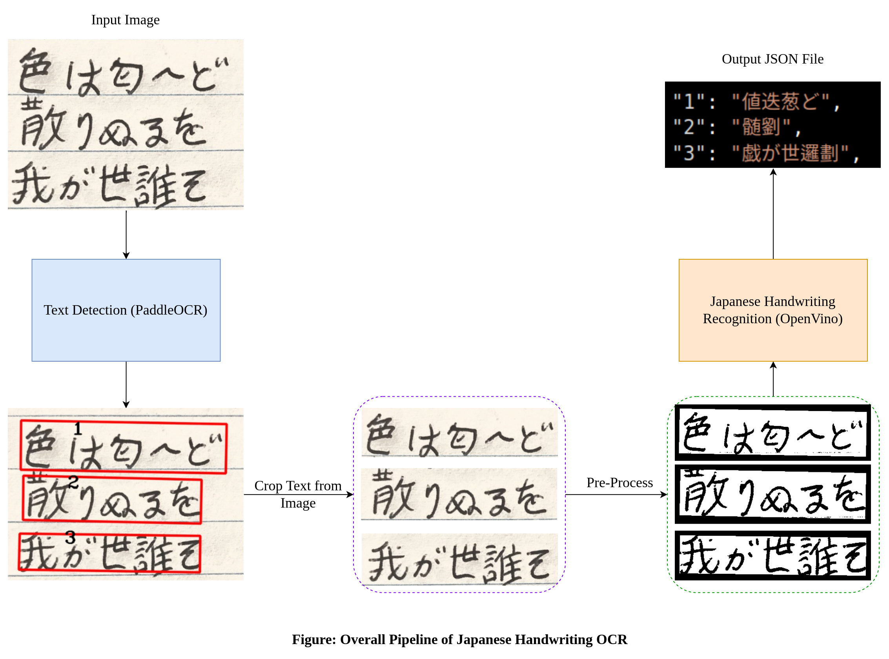
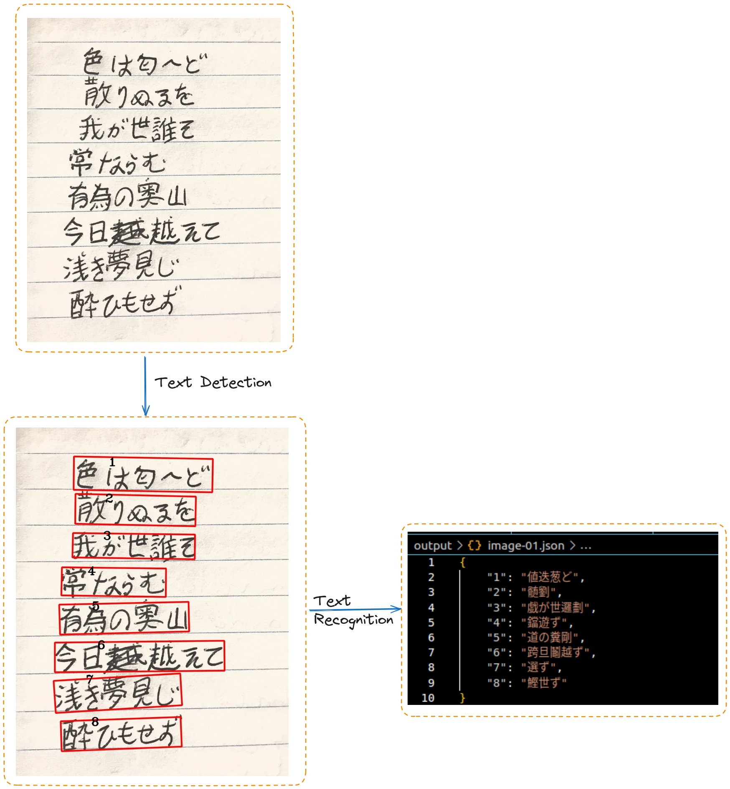

# Japanese Handwriting OCR

This project implements an Optical Character Recognition (OCR) system for Japanese handwriting using PaddleOCR for text detection and OpenVino's handwritten Japanese text recognition model.

Look into other OCR technique in [notebook dir](./notebooks/) 



### Prerequisites
- Python >= 3.8.0
- Pip >= 24.0

### Set Up a Virtual Environment
To create and activate a virtual environment:

**On macOS/Linux:**
```bash
python3 -m venv venv
source venv/bin/activate
pip install -r requirements.txt
```

**On Windows:**
```cmd
python -m venv venv
venv\Scripts\activate.bat  # Activate the virtual environment on Windows
pip install -r requirements.txt
```

**Update the model for text detection and and text recognition**

You can update the model for text detection and text recognition in [main.py](./main.py) if you want different models:
```python
text_detection = TextDetection(det_model_dir='model/det_model/ch_ppocr_server_v2.0_det_infer/')
text_recognition = TextRecognition('model/handwritten-japanese-recognition-0001/FP32/handwritten-japanese-recognition-0001')
```

### Run the OCR Application
To process an image of handwritten Japanese text:
```bash
python main.py japanese-handwriting-images/image-03.jpeg
```
### Demo


### References
- [PaddleOCR - Official Github Repo](https://github.com/PaddlePaddle/PaddleOCR/blob/main/README_en.md)
- [Image Processing in OpenCV - OpenCV documentation](https://docs.opencv.org/4.x/d2/d96/tutorial_py_table_of_contents_imgproc.html)

**OpenVINO**
- [Handwritten Chinese and Japanese OCR with OpenVINO - OpenVINO Documentation](https://docs.openvino.ai/2022.3/notebooks/209-handwritten-ocr-with-output.html)
- [OpenVINO Models Repository](https://storage.openvinotoolkit.org/repositories/open_model_zoo/2023.0/models_bin/1/)